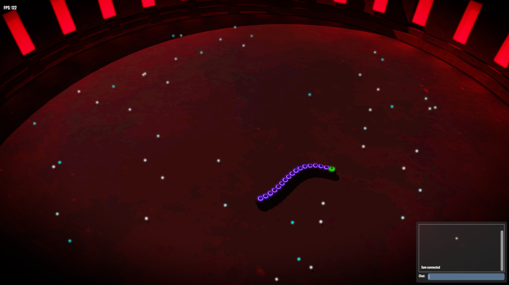

# Anguis

A 3D multiplayer third and first person snake game
Multiplayer *may* have some bugs :)
All models/textures by me. Sound is from opengameart.org


<br>

### Building
```
git clone https://github.com/STCollier/anguis
cd anguis
mkdir build
cd build
cmake ..
make
cd ../ && ./build/anguis
```

### Details
- Written in C++ and OpenGL 4.1
- Dependencies
    - GLAD (OpenGL loader)
    - GLFW (windowing & input)
    - GLM  (vector math)
    - ImGui (GUI)
    - socket.io (networking)
    - stb_image (loading images)
    - dr_wav (loading wav files for OpenAL)
    - openal-soft (Open Audio Library for playing audio)
- Graphical Features
    - .obj loader
    - HDR & Bloom
    - Real-time shadows
    - Multiplayer
    - Particle system
    - Audio
    - GUI done purely with ImGui <3